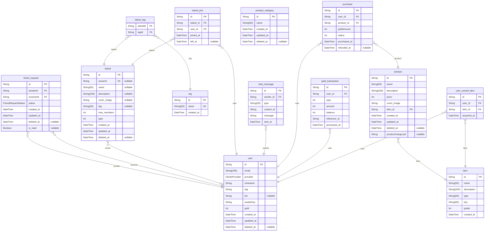

# Metamorn-ERD
> Generated by [`prisma-markdown`](https://github.com/samchon/prisma-markdown)

- [default](#default)

## default

### `user`

**Properties**
  - `id`: 
  - `email`: 
  - `provider`: 
  - `nickname`: 
  - `tag`: 
  - `bio`: 
  - `avatarKey`: 
  - `gold`: 
  - `created_at`: 
  - `updated_at`: 
  - `deleted_at`: 

### `friend_request`

**Properties**
  - `id`: 
  - `senderId`: 
  - `receiverId`: 
  - `status`: 
  - `created_at`: 
  - `updated_at`: 
  - `deleted_at`: 
  - `is_read`: 

### `island`

**Properties**
  - `id`: 
  - `ownerId`: 
  - `name`: 
  - `description`: 
  - `cover_image`: 
  - `tag`: 
  - `max_members`: 
  - `type`: 
  - `created_at`: 
  - `updated_at`: 
  - `deleted_at`: 

### `island_tag`

**Properties**
  - `islandId`: 
  - `tagId`: 

### `tag`

**Properties**
  - `id`: 
  - `name`: 
  - `created_at`: 

### `island_join`

**Properties**
  - `id`: 
  - `island_id`: 
  - `user_id`: 
  - `joined_at`: 
  - `left_at`: 

### `chat_message`

**Properties**
  - `id`: 
  - `sender_id`: 
  - `type`: 
  - `context_id`: 
  - `message`: 
  - `sent_at`: 

### `item`

**Properties**
  - `id`: 
  - `name`: 
  - `description`: 
  - `type`: 
  - `key`: 
  - `grade`: 
  - `created_at`: 

### `product`

**Properties**
  - `id`: 
  - `name`: 
  - `description`: 
  - `price`: 
  - `cover_image`: 
  - `item_id`: 
  - `created_at`: 
  - `updated_at`: 
  - `deleted_at`: 
  - `productCategoryId`: 

### `product_category`

**Properties**
  - `id`: 
  - `name`: 
  - `created_at`: 
  - `updated_at`: 
  - `deleted_at`: 

### `purchase`

**Properties**
  - `id`: 
  - `user_id`: 
  - `product_id`: 
  - `goldAmount`: 
  - `status`: 
  - `purchased_at`: 
  - `refunded_at`: 

### `gold_transaction`

**Properties**
  - `id`: 
  - `user_id`: 
  - `type`: 
  - `amount`: 
  - `balance`: 
  - `reference_id`: 
  - `processed_at`: 

### `user_owned_item`

**Properties**
  - `id`: 
  - `user_id`: 
  - `item_id`: 
  - `acquired_at`: 